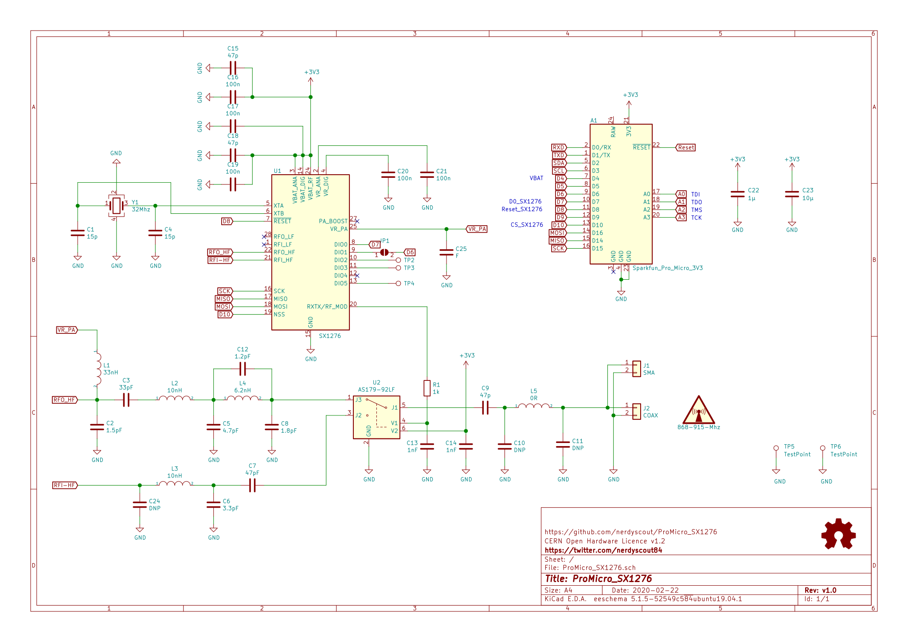

# ProMicro
There are all kinds of extension shields for the Arduino Uno and hundreds of breakout boards for various sensors. All [ProMicro modules](https://github.com/nerdyscout?tab=repositories&q=ProMicro) are a redesign of such boards, which still could be used for tinkering on a breadboard, but they are also stackable onto the [ProMicro](https://github.com/sparkfun/Pro_Micro).

# ProMicro_SX1276

## Documentation

<!--
to be done
### Pinout

-->

### Schematic

<!--
to be done
### Layout

-->

### Bill of Materials
<!--

-->

[interactive BOM](https://nerdyscout.github.io/ProMicro/SX1276/docs/bom/interactive.html)

<!--
### external

#### Tindie.com
#### kitspace.org
#### hackster.io
-->

## Credits
* [obra](https://github.com/obra) for [kicad-tools](https://github.com/obra/kicad-tools)

<!--
* [Sparkfun](sparkfun.com/) for [Graphical Datasheets](https://github.com/sparkfun/Graphical_Datasheets)
-->

## License
Copyright Stefan Herold 2020

This documentation describes Open Hardware and is licensed under the CERN OHL v.1.2.

You may redistribute and modify this documentation under the terms of the CERN OHL v.1.2. (http://ohwr.org/cernohl). This documentation is distributed WITHOUT ANY EXPRESS OR IMPLIED WARRANTY, INCLUDING OF MERCHANTABILITY, SATISFACTORY QUALITY AND FITNESS FOR A PARTICULAR PURPOSE. Please see the CERN OHL v.1.2 for applicable conditions
